# 🏃 SportsPulse Lakehouse

> **End-to-End Modern Data Lakehouse & Telemetry Pipeline for Multimodal Sports Cardiorespiratory Biosignals (SportDB)**

[](https://github.com/fabio-marques/sportspulse-lakehouse)
[](https://www.python.org/downloads/)
[](https://github.com/astral-sh/uv)
[-orange.svg)](#arquitetura-do-lakehouse)

---

## 📌 Visão Geral

O **SportsPulse Lakehouse** é uma plataforma de Engenharia de Dados de alta performance projetada para ingerir, processar, modelar e disponibilizar telemetria fisiológica e cardiorrespiratória em larga escala a partir do **SportDB** (*Sport Cardiorespiratory Database*).

O dataset contém dados brutos coletados por sensores vestíveis (*wearables*, como o Zephyr BioHarness 3.0) abrangendo **10 modalidades esportivas**, **81 atletas** e **126 sessões/aquisições**.

### 📊 Cobertura do Dataset (SportDB)

| Código | Modalidade | Categoria | Atletas ($S$) | Sessões ($CRD$) |
| :--- | :--- | :--- | :--- | :--- |
| **AER** | Aerial Silks | Tecido Acrobático / Força | 3 | 3 |
| **BAS** | Basketball | Esporte Coletivo / Intermitente Alta Intensidade | 9 | 9 |
| **CRO** | CrossFit | High-Intensity Functional Training (HIFT) | 19 | 28 |
| **FIT** | Fitness / Strength | Musculação / Resistência | 8 | 8 |
| **JOG** | Jogging | Corrida Contínua de Baixa/Média Intensidade | 5 | 19 |
| **MID** | Middle-Distance Running | Corrida de Média Distância | 10 | 10 |
| **RUN** | Running | Corrida de Longa Distância / Resistência | 10 | 10 |
| **SOC** | Soccer | Futebol / Resistência Intermitente | 2 | 14 |
| **TEN** | Tennis | Tênis / Intermitente com Ralis | 9 | 19 |
| **ZUM** | Zumba | Dança Fitness Aeróbica | 6 | 6 |
| **TOTAL** | **10 Modalidades** | — | **81 Atletas** | **126 Sessões** |

### 🧬 Sinais e Metadados
1. **`Data.mat`**: Sinais biométricos contínuos em formato MATLAB v5:
   - **`ECG`**: Eletrocardiograma bruto amostrado a **250 Hz**.
   - **`HR`**: Frequência Cardíaca instantânea amostrada a **1 Hz**.
   - **`RR`**: Intervalos entre picos R sucessivos do ECG ($R-R$ em milissegundos).
   - **`BR`**: Taxa Respiratória (*Breathing Rate*) contínua a **1 Hz**.
2. **`Dem.txt`**: Metadados demográficos e antropométricos (`Sex`, `Age`, `Weight`, `Height`, `Smoker`, `Alcool`, `Training_Rate`).
3. **`TrNote.txt`**: Segmentação temporal dos treinos em 3 fases (`Resting`, `Exercise`, `Recovery`).

---

## 🏛️ Arquitetura do Lakehouse (Medallion Architecture)

```mermaid
flowchart LR
    subgraph RawSource["01. Raw Data Source"]
        A["SportDB Directory\n(.mat, .txt)"]
    end

    subgraph BronzeLayer["02. Camada Bronze"]
        B["Ingestion Engine\n(SciPy / PyArrow)"]
        C[("Raw Parquet Storage\nParticionado por Esporte/Sessão")]
        A --> B --> C
    end

    subgraph SilverLayer["03. Camada Silver"]
        D["Cleaning & Alignment\n(Polars)"]
        E[("Standardized Series\nSincronização com Fases (Rest/Ex/Rec)")]
        C --> D --> E
    end

    subgraph GoldLayer["04. Camada Gold"]
        F["Physiological Feature Engine\n(HRV: RMSSD/SDNN, TRIMP)"]
        G[("Star Schema & Feature Store\n(DuckDB / Parquet)")]
        E --> F --> G
    end

    subgraph ServingLayer["05. Serving & Visualização"]
        H["DuckDB OLAP Engine"]
        I["Streamlit Analytics Dashboard"]
        G --> H --> I
    end
```



### Detalhamento das Camadas:
* **🥉 Camada Bronze (Ingestão & Preservação)**:
  - Leitura dos arquivos binários `.mat` legados e arquivos `.txt`.
  - Serialização para **Apache Parquet** colunar de alta compressão (Snappy/ZSTD).
  - Preservação da fidelidade dos dados brutos com rastreabilidade de linhagem.
* **🥈 Camada Silver (Limpeza & Enriquecimento)**:
  - Limpeza de ruídos de sensores e validação de faixas fisiológicas válidas.
  - Sincronização temporal de cada segundo com a respectiva fase do treino (`Resting`, `Exercise`, `Recovery`).
  - Enriquecimento cadastral com cálculo de IMC (*BMI*) e padronização de tipos de dados.
* **🥇 Camada Gold (Métricas Analíticas & Star Schema)**:
  - **Modelagem Dimensional**:
    - `dim_athlete`: Perfil antropométrico, idade e frequência de treino.
    - `dim_sport`: Modalidades esportivas e categorias de esforço.
    - `dim_phase`: Fases do protocolo de treinamento.
    - `fact_training_session`: Fato agregada por sessão (Duração, Carga TRIMP, FC Média/Máx, HRV).
    - `fact_telemetry_1s`: Fato granular temporal em 1 Hz para visualização detalhada.
  - **Feature Store Fisiológica**:
    - **HRV (Heart Rate Variability)**: Métricas no domínio do tempo (RMSSD, SDNN, pNN50).
    - **TRIMP (Training Impulse)**: Carga interna de treinamento de Banister baseada na FC de reserva.
    - **Razão HR/BR**: Índice de eficiência cardiorrespiratória.

---

## 🛠️ Stack Tecnológica

* **Linguagem & Runtime**: Python 3.10+
* **Gerenciador de Pacotes & Ambientes**: [uv](https://github.com/astral-sh/uv) (Astral)
* **Processamento de Dados**: [Polars](https://pola.rs/) & [Apache Arrow (PyArrow)](https://arrow.apache.org/)
* **Engine de Extração de Sinais**: [SciPy](https://scipy.org/) & [NumPy](https://numpy.org/)
* **Lakehouse & Analytical Engine**: [DuckDB](https://duckdb.org/)
* **Validação de Dados & Configurações**: [Pydantic](https://docs.pydantic.dev/) & [PyYAML](https://pyyaml.org/)
* **Dashboard & Visualização**: [Streamlit](https://streamlit.io/) & [Plotly](https://plotly.com/)
* **Testes & Qualidade**: [pytest](https://pytest.org/) & [Ruff](https://astral.sh/ruff)
* **Versionamento & Repositório**: Git & [GitHub CLI (gh)](https://cli.github.com/)

---

## 📂 Estrutura de Pastas do Projeto

```text
sportspulse-lakehouse/
├── .github/
│   └── workflows/
│       └── ci.yml               # Pipeline de integração contínua (CI)
├── config/
│   ├── settings.yaml            # Parâmetros gerais e limites fisiológicos
│   └── sports_mapping.yaml      # Mapeamento e categorias das 10 modalidades
├── data/                        # Diretório do Lakehouse (ignorado pelo Git)
│   ├── 01_raw/                  # Link/staging de dados brutos
│   ├── 02_bronze/               # Parquet bruto extraído
│   ├── 03_silver/               # Séries limpas, alinhadas e sincronizadas
│   └── 04_gold/                 # Star schema e DuckDB analítico
├── notebooks/                   # Análises exploratórias (Jupyter)
├── src/
│   └── sportspulse/
│       ├── ingestion/           # Módulos da Camada Bronze
│       │   ├── mat_parser.py
│       │   └── metadata_parser.py
│       ├── processing/          # Módulos da Camada Silver
│       │   ├── signal_cleaner.py
│       │   └── phase_aligner.py
│       ├── analytics/           # Módulos da Camada Gold
│       │   ├── hrv_metrics.py
│       │   ├── trimp.py
│       │   └── star_schema.py
│       ├── database/            # Conector DuckDB / Lakehouse
│       │   └── lakehouse.py
│       └── dashboard/           # Aplicação Streamlit
│           └── app.py
├── tests/                       # Testes automatizados com pytest
├── .env.example                 # Exemplo de variáveis de ambiente
├── .gitignore                   # Regras de exclusão de artefatos e dados
├── pyproject.toml               # Dependências e metadados gerenciados pelo uv
├── main.py                      # CLI principal do pipeline
└── README.md                    # Documentação do projeto
```

---

## 🚀 Como Executar o Projeto

### 1. Pré-requisitos
Certifique-se de ter o `git` e o `uv` instalados no seu sistema.

```bash
# Instalar o uv (caso ainda não tenha instalado)
curl -LsSf https://astral.sh/uv/install.sh | sh
```

### 2. Clonar ou Inicializar o Ambiente
Dentro da pasta do projeto:

```bash
# Sincronizar o ambiente virtual e instalar todas as dependências
uv sync

# Ativar o ambiente virtual (opcional, o uv pode rodar direto com `uv run`)
source .venv/bin/activate
```

### 3. Execução dos Módulos do Pipeline (CLI)

```bash
# 1. Executar ingestão da Camada Bronze (extração dos arquivos .mat e .txt)
uv run python main.py ingest

# 2. Executar transformação da Camada Silver (limpeza e sincronização temporal)
uv run python main.py process

# 3. Executar modelagem da Camada Gold (Star Schema, HRV e TRIMP)
uv run python main.py analytics

# 4. Iniciar o Dashboard Interativo
uv run streamlit run src/sportspulse/dashboard/app.py
```

### 4. Execução de Testes
```bash
uv run pytest -v
```

---

## 🗺️ Roadmap de Desenvolvimento

- [x] **Etapa 1**: Estrutura inicial do projeto, configurações, dependências (`uv`) e documentação (`README.md`).
- [ ] **Etapa 2**: Ingestão da Camada Bronze (Parsers de arquivos `.mat` e metadados `.txt` para Parquet particionado).
- [ ] **Etapa 3**: Processamento da Camada Silver (Tratamento de ruídos, alinhamento temporal e marcação de fases).
- [ ] **Etapa 4**: Modelagem da Camada Gold (Métricas de HRV, TRIMP de Banister, tabelas Dimensão e Fato no DuckDB).
- [ ] **Etapa 5**: Dashboard Interativo Streamlit para visualização comparativa de biomarcadores entre modalidades.
- [ ] **Etapa 6**: Testes automatizados de ponta a ponta e documentação final de entrega.

---

## 👤 Autor
* **Fabio Marques**
