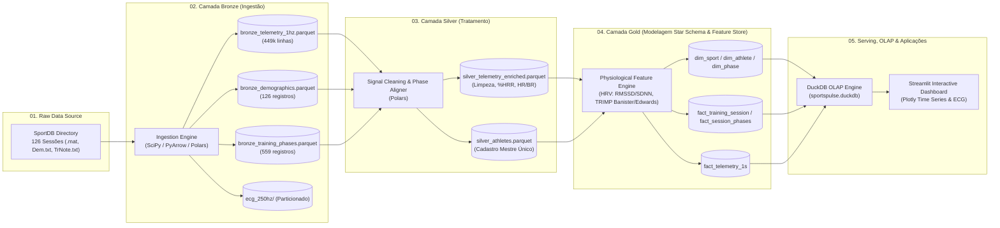

# 🏃 SportsPulse Lakehouse

> **End-to-End Modern Data Lakehouse & Telemetry Pipeline for Multimodal Sports Cardiorespiratory Biosignals (SportDB)**

[](https://github.com/fabiomarquesz/sportspulse-lakehouse)
[](https://www.python.org/downloads/)
[](https://github.com/astral-sh/uv)
[-orange.svg)](#arquitetura-do-lakehouse)
[](#testes-automatizados)

---

## 📌 Visão Geral do Projeto

O **SportsPulse Lakehouse** é uma plataforma completa de Engenharia de Dados desenvolvida para ingerir, tratar, modelar dimensionalmente e disponibilizar sinais de telemetria fisiológica e cardiorrespiratória em larga escala a partir da base científica **SportDB** (*Sport Cardiorespiratory Database*).

O dataset contém registros brutos adquiridos por sensores vestíveis (*wearables*, como o **Zephyr BioHarness 3.0**), abrangendo **10 modalidades esportivas**, **81 atletas** e **126 sessões experimentais**, totalizando mais de **449.000 segundos de telemetria contínua**.

---

## 📊 Cobertura do Dataset (SportDB)

| Código | Modalidade | Categoria de Treinamento | Atletas ($S$) | Sessões ($CRD$) | FC Média | Carga TRIMP (Média) |
| :--- | :--- | :--- | :--- | :--- | :--- | :--- |
| **AER** | Aerial Silks | Tecido Acrobático / Força | 3 | 3 | 131.0 bpm | 90.3 |
| **BAS** | Basketball | Esporte Coletivo / Intermitente Alta Intensidade | 9 | 9 | 130.2 bpm | 84.0 |
| **CRO** | CrossFit | High-Intensity Functional Training (HIFT) | 19 | 28 | 132.6 bpm | 30.4 |
| **FIT** | Fitness / Strength | Musculação / Hipertrofia / Resistência | 8 | 8 | 121.9 bpm | 27.7 |
| **JOG** | Jogging | Corrida Contínua de Baixa/Média Intensidade | 5 | 19 | 123.7 bpm | 53.6 |
| **MID** | Middle-Distance Running | Corrida de Média Distância (800m a 5000m) | 10 | 10 | 139.6 bpm | 18.9 |
| **RUN** | Running | Corrida Contínua de Longa Distância / Resistência | 10 | 10 | 180.7 bpm | 118.9 |
| **SOC** | Soccer | Futebol / Resistência Intermitente com Bola | 2 | 14 | 112.5 bpm | 66.0 |
| **TEN** | Tennis | Tênis de Quadra com Ralis e Pausas | 9 | 19 | 134.5 bpm | 95.7 |
| **ZUM** | Zumba | Dança Fitness Aeróbica | 6 | 6 | 133.2 bpm | 68.6 |
| **TOTAL** | **10 Modalidades** | — | **81 Atletas** | **126 Sessões** | **~135 bpm** | — |

---

## 🏛️ Arquitetura Medallion Lakehouse



---

## 🛠️ Stack Tecnológica

* **Linguagem & Runtime**: Python 3.12+
* **Gerenciador de Pacotes & Ambientes**: [uv](https://github.com/astral-sh/uv) (Astral)
* **Processamento de Dados**: [Polars](https://pola.rs/) & [Apache Arrow (PyArrow)](https://arrow.apache.org/)
* **Engine de Extração de Sinais Fisiológicos**: [SciPy](https://scipy.org/) & [NumPy](https://numpy.org/)
* **Lakehouse & Motor Analítico SQL**: [DuckDB](https://duckdb.org/)
* **Dashboard Analítico Interativo**: [Streamlit](https://streamlit.io/) & [Plotly](https://plotly.com/)
* **CLI & Console UX**: [Typer](https://typer.tiangolo.com/) & [Rich](https://rich.readthedocs.io/)
* **Validação de Dados & Configurações**: [Pydantic](https://docs.pydantic.dev/) & [PyYAML](https://pyyaml.org/)
* **Testes Automatizados**: [pytest](https://pytest.org/) & [Ruff](https://astral.sh/ruff)
* **Versionamento**: Git & [GitHub CLI (`gh`)](https://cli.github.com/)

---

## 📂 Estrutura Completa do Repositório

```text
sportspulse-lakehouse/
├── .github/
│   └── workflows/
│       └── ci.yml               # Pipeline de CI (GitHub Actions)
├── config/
│   ├── settings.yaml            # Parâmetros gerais, limites fisiológicos e caminhos
│   └── sports_mapping.yaml      # Mapeamento e categorias das 10 modalidades
├── data/                        # Diretório do Lakehouse (ignorado pelo Git)
│   ├── 01_raw/                  # Staging de dados brutos
│   ├── 02_bronze/               # Parquet bruto particionado + ECG 250Hz
│   ├── 03_silver/               # Séries limpas, sincronizadas e enriquecidas
│   └── 04_gold/                 # Star Schema Parquet e DuckDB Lakehouse
├── src/
│   └── sportspulse/
│       ├── ingestion/           # Camada Bronze
│       │   ├── mat_parser.py    # Leitor MATLAB v5 (.mat)
│       │   ├── metadata_parser.py # Leitor Dem.txt e TrNote.txt
│       │   └── bronze_pipeline.py # Orquestrador da Camada Bronze
│       ├── processing/          # Camada Silver
│       │   ├── signal_cleaner.py # Limpeza de ruídos e detecção de artefatos
│       │   ├── phase_aligner.py # Sincronização temporal com fases do treino
│       │   └── silver_pipeline.py # Orquestrador da Camada Silver
│       ├── analytics/           # Camada Gold
│       │   ├── hrv_metrics.py   # Variabilidade Cardíaca (RMSSD, SDNN, pNN50)
│       │   ├── trimp.py         # Banister TRIMP, Edwards TRIMP e Gasto Calórico
│       │   ├── star_schema.py   # Modelagem dimensional Fato / Dimensão
│       │   └── gold_pipeline.py # Orquestrador da Camada Gold
│       ├── database/            # Conector Lakehouse
│       │   └── lakehouse.py     # Gerenciador DuckDB e Views Analíticas SQL
│       └── dashboard/           # Aplicação Visual
│           └── app.py           # Dashboard Streamlit Interativo
├── tests/                       # Suíte de Testes com Pytest (100% passing)
│   ├── test_mat_parser.py
│   ├── test_silver_processing.py
│   └── test_gold_analytics.py
├── .env.example
├── .gitignore
├── pyproject.toml               # Dependências gerenciadas via uv
├── main.py                      # CLI Unificada do Pipeline
└── README.md                    # Documentação Completa
```

---

## 🚀 Como Executar o Projeto

### 1. Clonar e Instalar Dependências com `uv`

```bash
git clone https://github.com/fabiomarquesz/sportspulse-lakehouse.git
cd sportspulse-lakehouse

# Sincronizar o ambiente virtual e instalar dependências
uv sync
```

### 2. Executar o Pipeline Completo (CLI)

Você pode executar o pipeline completo de ponta a ponta com um único comando:

```bash
uv run python main.py run-all
```

Ou executar camadas individuais conforme necessário:
```bash
# Executar Camada Bronze (Ingestão)
uv run python main.py ingest

# Executar Camada Silver (Tratamento e Enriquecimento)
uv run python main.py process

# Executar Camada Gold (Star Schema, HRV, TRIMP & DuckDB)
uv run python main.py analytics
```

### 3. Iniciar o Dashboard Interativo

```bash
uv run python main.py dashboard
```
Acesse no seu navegador em: `http://localhost:8501`

---

## 🧪 Testes Automatizados

O projeto conta com suíte de testes unitários para todas as camadas do pipeline:

```bash
uv run python main.py test
```

Resultado da execução:
```text
============================== 10 passed in 0.30s ==============================
```

---

## 👤 Autor
* **Fabio Marques** — [GitHub](https://github.com/fabiomarquesz)

---

## 📚 Fonte dos Dados & Créditos Científicos

Os dados brutos utilizados neste projeto são provenientes do repositório científico e publicação na **[ScienceDirect](https://www.sciencedirect.com)** (Elsevier *Data in Brief*):

* **Base de Dados**: *SportDB - Sport Cardiorespiratory Database*
* **Portal / Editora**: [ScienceDirect (Elsevier)](https://www.sciencedirect.com)
* **Finalidade**: Pesquisa acadêmica e desenvolvimento de soluções tecnológicas para monitoramento fisiológico, biomecânica e telemetria esportiva.
* **Dispositivo de Aquisição Primário**: Zephyr BioHarness 3.0 (sensores vestíveis de frequência cardíaca, intervalos R-R, frequência respiratória e ECG a 250 Hz).
